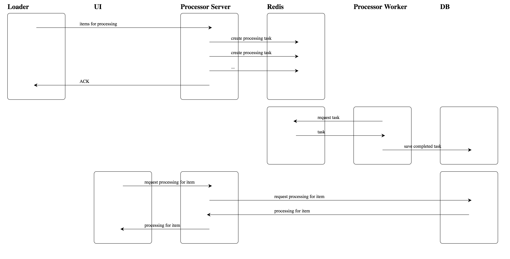

```
python swimlane/swimlane.py my_swimlane.json > my_swimlane.svg
```

##### Example

###### Input

```json
{
  "peers": [
    ["Loader", "After loading data into the relational database, new items are sent to the processor server for processing."],
    ["UI", "The UI requests processings via AJAX."],
    ["Processor Server", "The Processor Server is responsible for causing N different processing tasks to be done to each item."],
    ["Redis", "Redis acts as the celery message broker: the web server sends tasks to redis, and celery worker processes take tasks from redis."],
    ["Processor Worker", "A celery worker consuming tasks for a single Processor."],
    ["DB", "Relational database accessed by both the server and celery worker processes."]
  ],
  "messages": [

    [["Loader", "Processor Server", "items for processing"],
     ["Processor Server", "Redis", "create processing task"],
     ["Processor Server", "Redis", "create processing task"],
     ["Processor Server", "Redis", "..."],
     ["Processor Server", "Loader", "ACK"]],

    [["Processor Worker", "Redis", "request task"],
     ["Redis", "Processor Worker", "task"],
     ["Processor Worker", "DB", "save completed task"]],

    [["UI", "Processor Server", "request processing for item"],
     ["Processor Server", "DB", "request processing for item"],
     ["DB", "Processor Server", "processing for item"],
     ["Processor Server", "UI", "processing for item"]
    ]
  ]
}
```

###### Output



##### Pessimism

> Software is invisible and unvisualizable. Geometric abstractions are powerful tools. The floor plan of a building helps both architect and client evaluate spaces, traffic flows, views. Contradictions and omissions become obvious. Scale drawings of mechanical parts and stick-figure models of molecules, although abstractions, serve the same purpose. A geometric reality is captured in a geometric abstraction.

> The reality of software is not inherently embedded in space. Hence, it has no ready geometric representation in the way that land has maps, silicon chips have diagrams, computers have connectivity schematics. As soon as we attempt to diagram software structure, we find it to constitute not one, but several, general directed graphs superimposed one upon another. The several graphs may represent the flow of control, the flow of data, patterns of dependency, time sequence, name-space relationships. These graphs are usually not even planar, much less hierarchical. Indeed, one of the ways of establishing conceptual control over such structure is to enforce link cutting until one or more of the graphs becomes hierarchical. [1]

> In spite of progress in restricting and simplifying the structures of software, they remain inherently unvisualizable, and thus do not permit the mind to use some of its most powerful conceptual tools. This lack not only impedes the process of design within one mind, it severely hinders communication among minds.

Frederick P. Brooks, [No Silver Bullet](http://www.cs.nott.ac.uk/~cah/G51ISS/Documents/NoSilverBullet.html)
